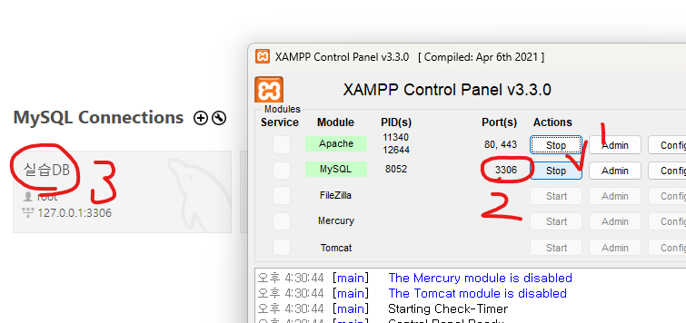
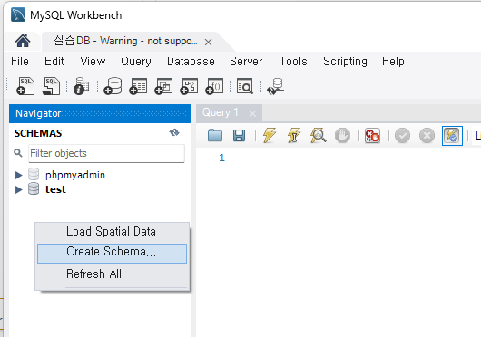
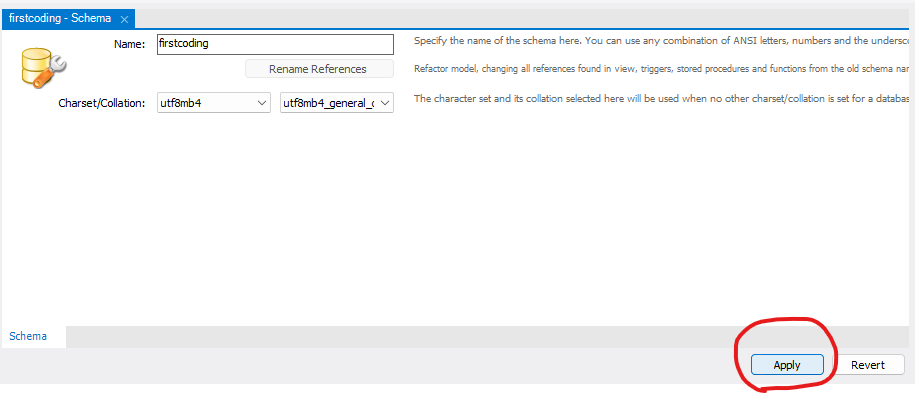
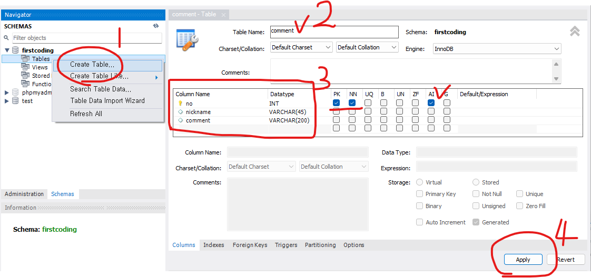
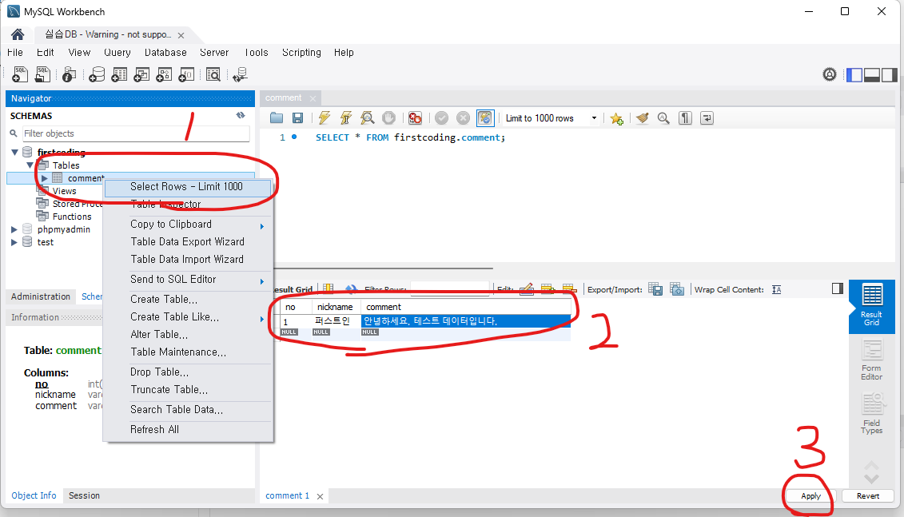
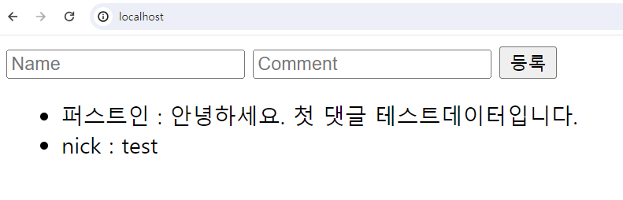

# PHP 게시판 서버 개발 프로젝트
### 사용 기술: HTML, CSS, JavaScript, PHP, DB(mysql)

## 게시판을 만들기 전 간단한 구조의 CRUD(생성, 조회, 수정, 삭제)를 구현해보자
 - 본 1편에서 생성될 서버(htdocs폴더 내) 파일 목록은 다음과 같다.
     - index.php
     - comment.php
 - 실습 환경의 실행은 xampp프로그램의 Apache서버, MySQL 구동 후 Chrome브라우저로 http://localhost 로 접속하여 실행한다.

### 기본: PHP에서 Form데이터 처리하기
 - 먼저, 간단한 댓글 등록 폼으로 설명한다.
 - 서버 기능 구현에 집중하여 css디자인은 생략하고 설명한다. (프로젝트에서 본인이 직접 화면 구현을 수행하세요.)
 - index.html에 다음과 같이 form을 구현한다.

```html
<body>
    <form method="post" action="comment.php"> <!-- submit시 comment.php로 이동과 함께 데이터가 전달된다. -->
        <input type="text" placeholder="Name"  name="nickname"> <!-- 전달할 데이터는 반드시 name속성이 있어야한다. -->
        <input type="text" placeholder="Comment"  name="comment">
        <button type="submit">등록</button>
    </form>
</body>
```

 - comment.php에서 다음과 같이 index.html에서 POST 넘어온 데이터를  출력해볼 수 있다.

```php
<?php
    $nickname = $_POST['nickname']; // Form에서 input의 name속성의 값이 $_POST[] 배열의 key가 된다.
    $comment = $_POST['comment'];

    echo "작성자: {$r['nickname']} <br>댓글: {$r['comment']}";
?>
```
 - php에서 POST로 전달 받은 데이터를 DB에 기록(INSERT)하여 자료를 저장하면 이것이 "등록" 기능이 된다.


## 조회 기능 구현

 - 메인 화면에서는 댓글의 목록을 DB에서 조회하여 보여줄 수 있다.
 - 데이터베이스(DB)는 데이터를 관리해주는 역할을 한다. 이러한 소프트웨어를 DBMS라고 한다.
 - DBMS의 종류는 여러 가지가 있다. (Oracle, MySQL, SQLite, MongoDB, Redis등..)
 - 실습에는 MySQL을 활용한다.

### DB환경 (MySQL)
 - PC에 XAMPP 서버 프로그램을 설치하면 기본적으로 apache서버와 MySQL서버가 설치된다.
 - DB의 내부 자료를 관리하려면 DBMS에 접속할 클라이언트 프로그램이 필요한데 실습에서는 MySQL Workbench 프로그램을 활용한다.

    


### 댓글 데이터 설계 및 DB 테이블 생성
 - DB서버 구동 후 MySQL Workbench로 DB에 접속한다.
 - 댓글 자료를 저장할 테이블을 생성한다.
 - 테이블 컬럼(열)은 다음과 같이 설계한다.
     - no: 댓글 일련번호 (숫자)
     - nickname: 글 등록자 이름 (문자열)
     - comment: 댓글 내용 (문자열)
 - 좌측 SCHEMAS탭에 DB목록이 보이는데 마우스 우측 버튼 메뉴로 Create Scheme을 눌러 새로운 DB를 생성할 수 있다.

    

 - Charset은 utf8mb4 / utf8mb4_general_ci로 설정한다. (다국어 및 이모지 문자 지원)

    

 - 다음 화면을 참고하여 comment테이블을 생성한다.

    

 - 생성된 테이블에 테스트용 임시 데이터를 기록해넣는다.
    - no는 비워두거나(NULL값) 1부터 순차적으로 입력한다.
    

### php에서 댓글 조회 코드를 구현한다.
 - 다음 php코드는 앞서 만든 댓글 DB에서 글 목록을 조회하여 html의 `<li></li>`태그로 한 줄씩 출력한다.
 - index.php

 ```php
<!DOCTYPE html>
<html lang="ko">
<head>
    <meta charset="UTF-8">
    <meta name="viewport" content="width=device-width, initial-scale=1.0">
    <title>댓글</title>
</head>
<body>
    <div>
        <!-- 댓글 입력 Form 영역 -->
    </div>

    <div>
        <!-- 댓글 목록 보여주기 -->
        <ul>
<?php
// PHP로 DB에서 댓글 목록을 가져와 보여준다.

    $conn = new PDO("mysql:host=127.0.0.1;dbname=firstcoding" /* DB서버 및 DB명 */, "root"/* DB 아이디 */, "" /* 비번 */);

    // SQL쿼리문을 생성한다.
    $stmt = $conn->prepare("SELECT * FROM comment"); 

    // SQL쿼리를 실행한다.
    $stmt->execute();

    // 결과를 한 줄씩 가져와(fetch) 출력한다.
    while ($r = $stmt->fetch(PDO::FETCH_ASSOC)) {
        echo "<li>{$r['nickname']} : {$r['comment']}</li>"; 
    }
?>
        </ul>
    </div>
</body>
</html>
 ```
 - 웹 브라우저로 서버에 접속해보면 다음과 같이 DB의 데이터가 페이지에 표시되는것을 확인할 수 있다.

    

## 댓글 등록 기능 구현
 - 맨 처음 구현한 Form의 데이터를 POST로 받아 위 예시처럼 데이터베이스에 접속하여 INSERT하는 PHP를 작성해보자.
 - comment.php

```php
<?php
    // POST로 FORM에서 전달 받은 값을 가져온다.
    $nickname = $_POST['nickname'];
    $comment = $_POST['comment'];

    // DB서버에 접속한다.
    $conn = new PDO("mysql:host=127.0.0.1;dbname=firstcoding" /* DB서버 및 DB명 */, "root"/* DB 아이디 */, "" /* 비번 */);
        
    // SQL쿼리문을 생성한다.
    $stmt = $conn->prepare("INSERT INTO comment (nickname, comment) VALUES (:nickname, :comment)"); 

    // bindParam을 통해 필요한 값을 쿼리에 결합한다.
    $stmt->bindParam(':nickname', $nickname);
    $stmt->bindParam(':comment', $comment);

    // SQL쿼리를 실행한다.
    $stmt->execute();

    // 다시 원래 화면으로 돌려보낸다.
    header('Location: /');
?>
```

### 수정과 삭제
 - 다음 편에 계속...